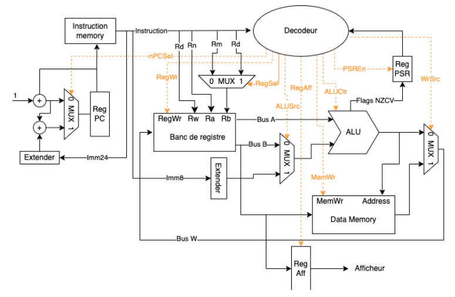

# Single-Cycle MIPS Processor (VHDL)

 


## Authors

* Florian LAINE (Frayzen)
* Sanghyeon PARK (Ropopo) 

## Project Overview
This repository contains a complete implementation of a 32-bit single-cycle MIPS processor in VHDL, developed as part of a digital design course. The processor integrates fundamental computer components including:

- Register file (32 registers)
- Arithmetic Logic Unit (ALU)
- Control unit
- Instruction memory
- Data memory
- Program counter



## Key Features
- **MIPS ISA Support**: Implements core instructions (R-type, I-type, J-type) **Pipelined Design**: Single-clock-cycle-per-instruction execution
- **Tested Components**:
  - 32x32-bit register file with dual read ports
  - ALU with 16 operations (AND, OR, ADD, SUB, etc.)
  - Branch prediction unit
- **FPGA Proven**: Synthesizable design tested on Intel/Altera DE10 boards

## Simulation & Verification
### Requirements
- ModelSim
- VHDL-2008 compatible simulator
- vhdeps python module to compile

### Running Tests
```bash
# Compile all components
./simu/compile.sh


# Run main testbench
./simu/run_tests.sh

# Debug specific test
./simu/debug.sh # Note that fzf is recommended (but not required)


